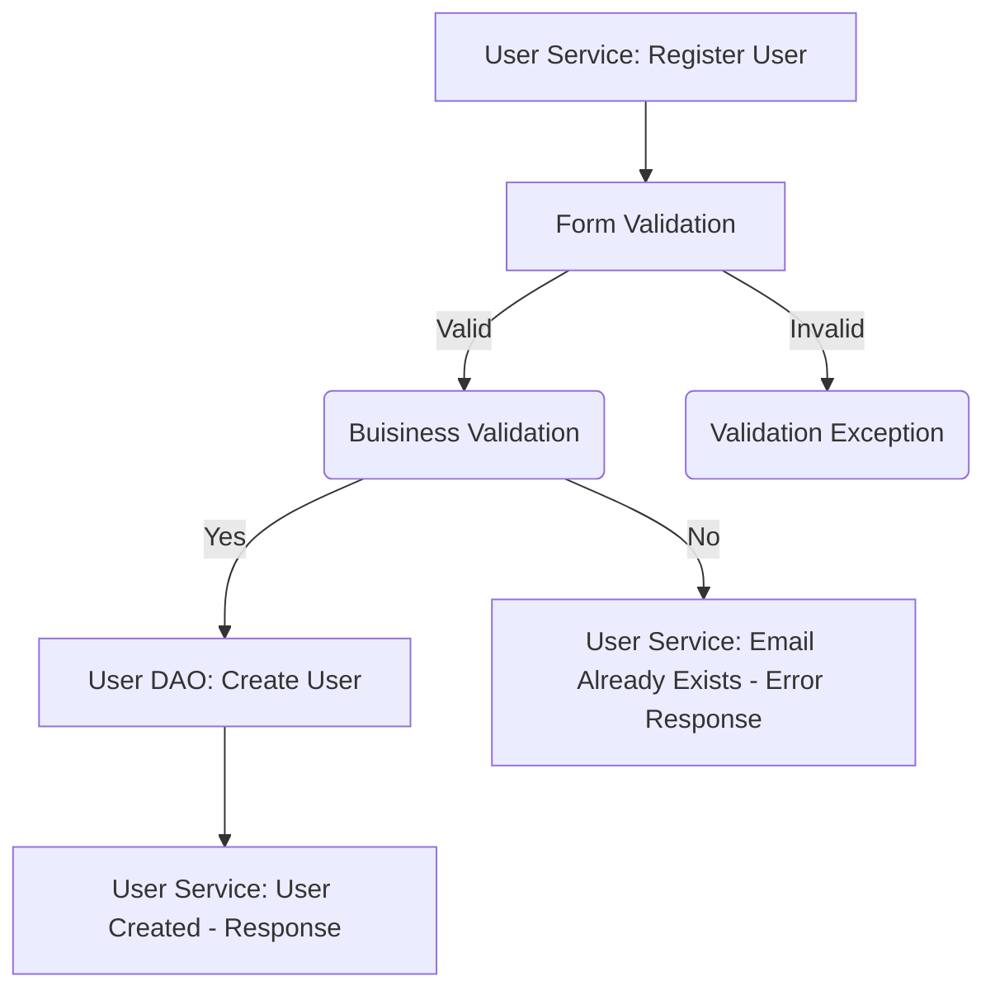
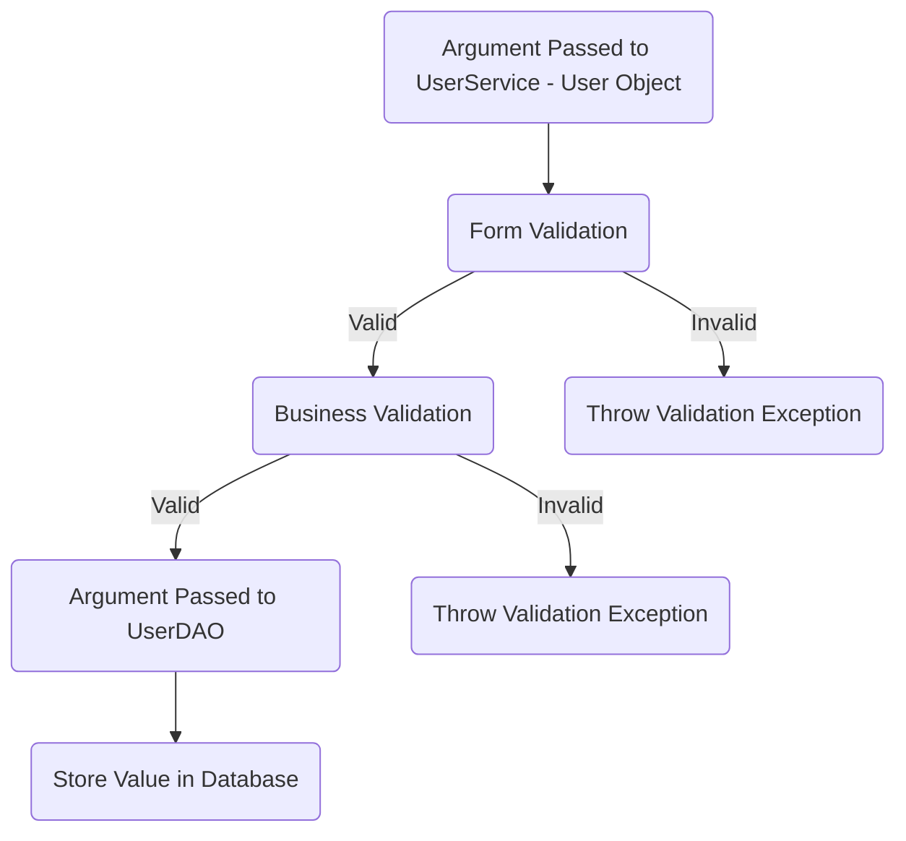
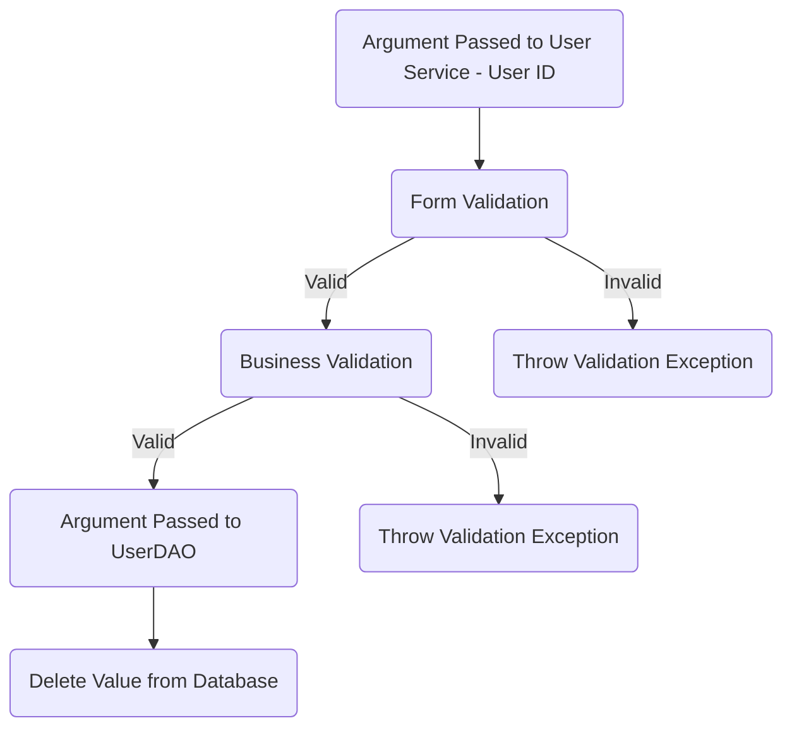
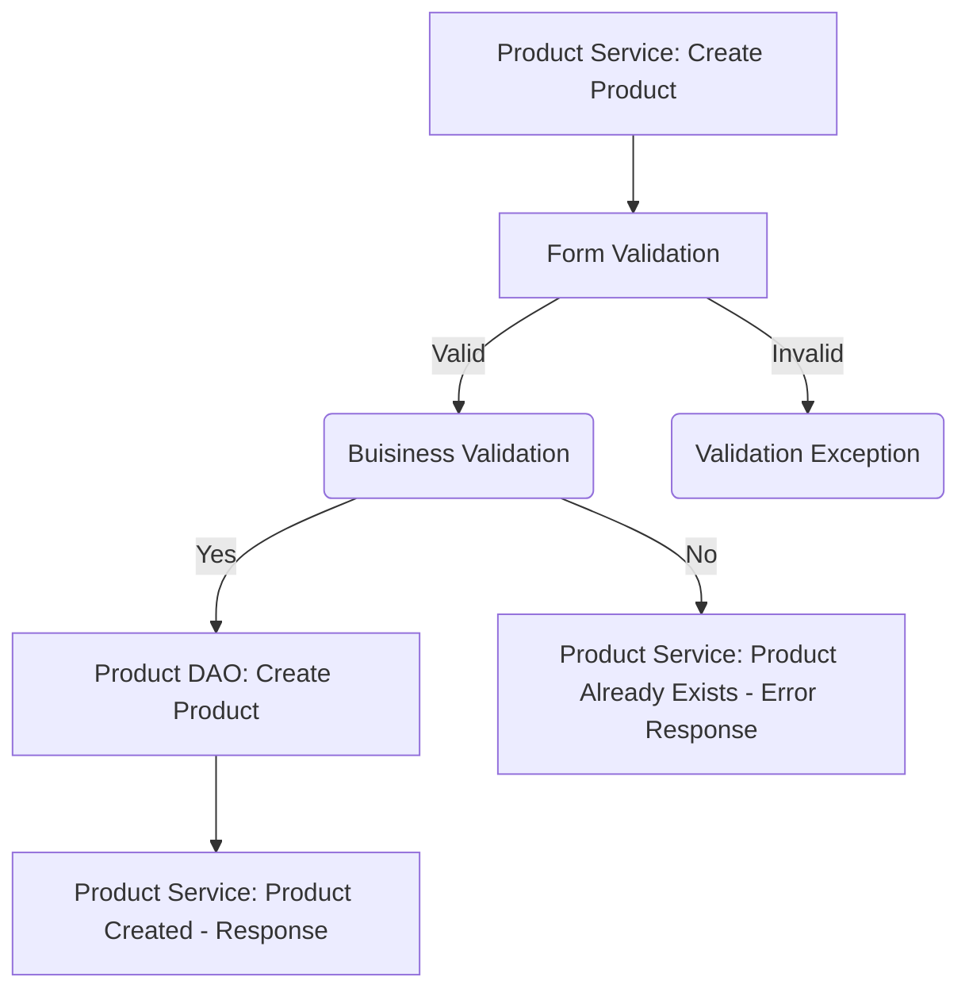
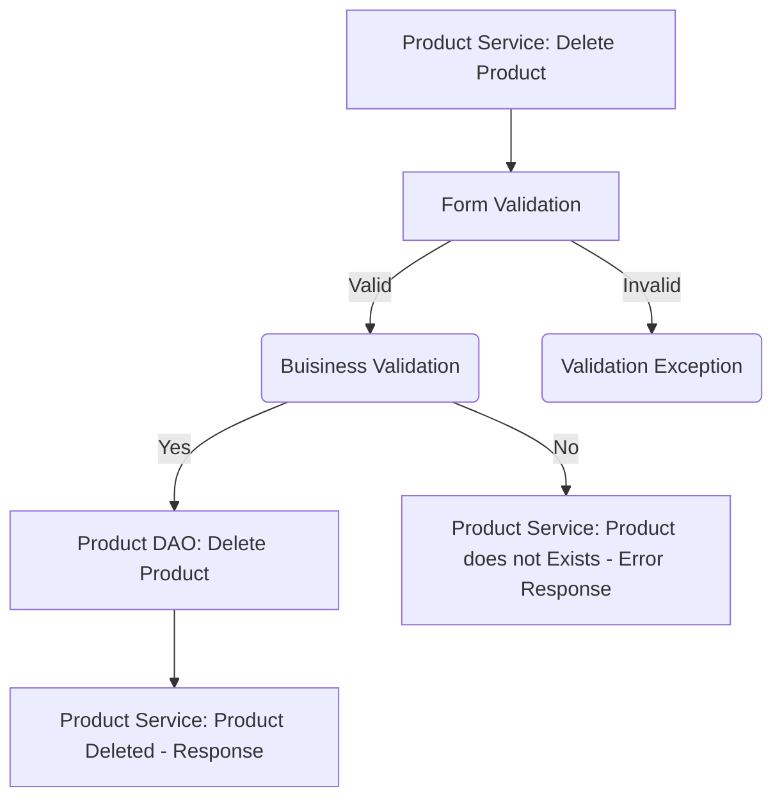
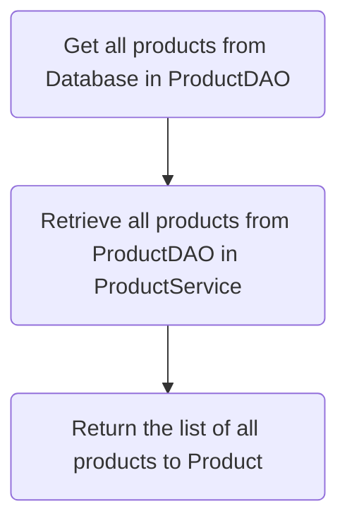
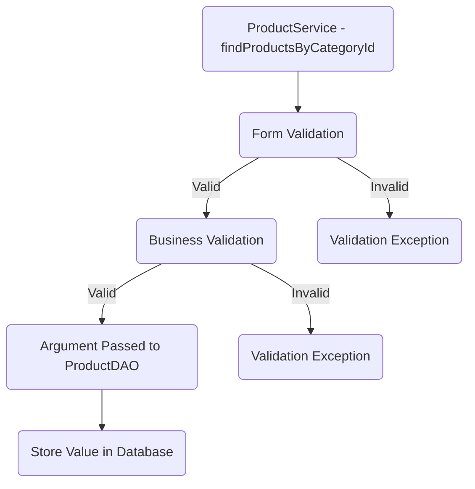
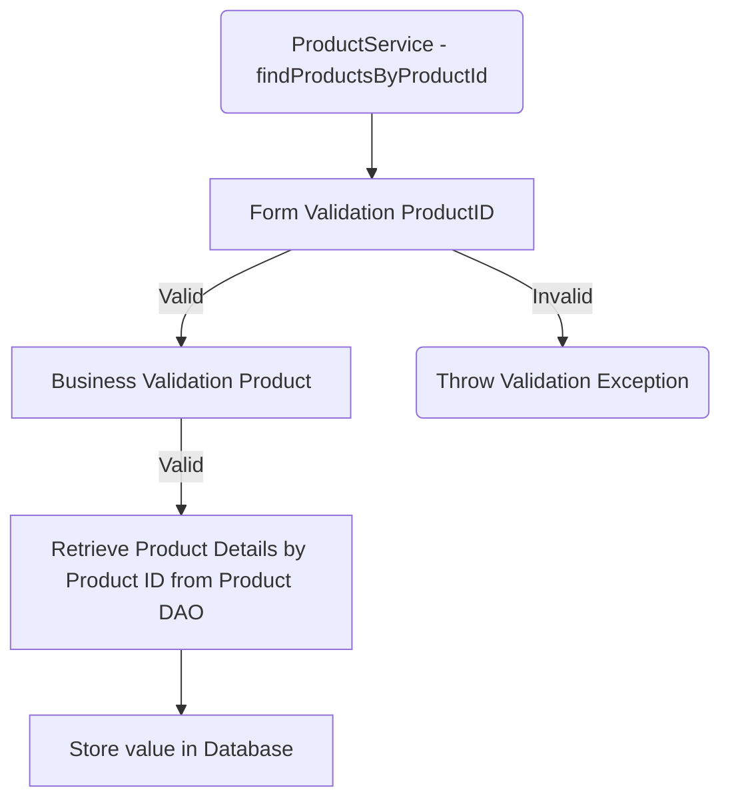

# Miss Nature

## Database Design

- [ ] Create an ER diagram of the database
- [ ] Write Create table scripts [script](src/main/resources/db/migration/V1__create_users.sql)


## Project Setup

- [ ] Create a new Java project
- [ ] Set up a MySQL database
- [ ] Add necessary libraries
	- [ ] JDBC, 
	- [ ] MySQL Connector, 
	- [ ] JUnit, 
	- [ ] Dotenv.

## Module: Users 
### Feature: Create User

>Create a new user in a database.
#### Pre-requisites:
- [ ] user table
- [ ] user model
- [ ]  user DAO( create )
- [ ]  user service ( create )
#### Validations:
   - [ ]   Form 	Validation
       * user null
       * name ( null, empty, pattern )
       * email ( null, empty, pattern )
       * password ( null, empty, pattern )
       * phone number ( length, >= 600000001 && <= 9999999999 )
    - [ ]   Business Validation
       * Check whether the email is already exists
#### Messages:
   * Invalid User object.
   * Name cannot be null or empty.
   * Name should match the pattern.
   * Password format is invalid.
   * Password cannot be null or empty.
   * Password must contain at least 8 characters.
   * Invalid phone number. 
   * The email already exists.
   * Email cannot be null or empty.
   * Email should match the format pattern.
#### Pre-requisites:
- [ ] Create User table
- [ ] Implement User model
- [ ] Implement User DAO (create)
#### Flow: 

### Feature: Update User  
#### Pre-requisites:  
- [ ]   Implements User Service(update(int id, User user))
- [ ]  Implement User DAO(update(int id, User user))
#### Validations:

 - [ ]   Form Validation
	 * Id <= 0 
	 * user null  
	 * name ( null, empty, pattern )  
	 * password ( null, empty, pattern )  
    * phone number ( length, >= 600000001 && <= 9999999999 )  

- [ ]   Business Validation
	* Check whether the ID exists or not
#### Messages:
   * Invalid user id
   * Invalid User object
   * Name cannot be null or empty
   * Name should match the pattern 
   * Password cannot be null or empty
   * Password doesn't match the required format
   * Invalid phone number 
   * User ID not found 
 #### Flow:  
> Update a User details in a database.


### Feature: Delete User
 #### Pre-requisites: 
  - [ ] Implements User Service (delete(int id))
  - [ ]  - [ ] Implement User DAO (delete(int id)) 
#### Validations: 
 - [ ] Form Validation
	 * ID <= 0 
- [ ] Business Validation 
	 * Check whether the ID exists or not
 #### Messages: 
  * Invalid user ID 
  * User ID not found 
  #### Flow: 
  > Delete a User from the database. 


## Module: Product

### Feature : Create Product
>Create a new product in a database.
#### Pre-requisites:
- [ ] category table
- [ ] category model
- [ ] Category DAO ( findAllfindById)
- [ ] Category service ( findAllfindById )
- [ ] Product table
- [ ] Product model
- [ ] Product DAO ( create )
- [ ] Product service ( create )
#### Validations:
   - [ ]   Form Validation(Product)
        * Product null
        * Category Id <=0
        * Price <=0
        * Product name (null or empty string or pattern)
        * Product weight(null or empty string)
        * Ingredients cannot be (null or empty string)
        * Description(null or empty string)
        * Benefits(null or empty string)
        * How to use(null or empty string)
        * Shelf life(null or empty string)
- [ ]  Business Validation(Product)
	 * Check whether the category ID is available or not in the Category table
	 * Check whether the product already exists.
	 
#### Messages:
   * Invalid Product object
   * Invalid Category Id
   * Price cannot be zero or negative
   * Product name cannot be null or empty
   * Product name should match the pattern
   * Product weight cannot be null or empty
   * Ingredients cannot be null or empty	  
   * Description cannot be null or empty
   * Benefits cannot be null or empty
   * How to use cannot be null or empty
   * shelf life cannot be null or empty
   * Category is not Available
   * The product is already exists
#### flow
	


### Feature: Update Product  
> Update an existing product's details in the database.  
#### Pre-requisites:  
- [ ] Category table
- [ ] Category model
- [ ] Category DAO ( findAll findById)
- [ ] Category service ( findAll findById )
- [ ] Category DAO 
- [ ] Category service 
- [ ] Product table
- [ ] Product model
- [ ] Product DAO ( update )
- [ ] Product service ( update )

#### Validations: 
 - [ ] Form Validation(Product)
	  * Product null
	  * Product Id <= 0  
	  * Price <= 0
	  * Product name (null or empty string or pattern)  
	  * Product weight (null or empty string)
	  * Ingredients cannot be (null or empty string)
	  * Description (null or empty string) 
	  * Benefits (null or empty string)  
	  * How to use (null or empty string)  
	  * Shelf life (null or empty string)  
- [ ] Business Validation(Product)  
	* Check whether the Product ID is available in the Product table. 
	* Check whether the Product exists.
#### Messages:
  * Invalid Product object
  * Invalid Product Id 
  * Price cannot be zero or negative 
  * Product name cannot be null or empty 
  * Product name should match the pattern
  * Product weight cannot be null or empty 
  * Ingredients cannot be null or empty 
  * Description cannot be null or empty  
  * Benefits cannot be null or empty 
  * How to use cannot be null or empty 
  * Shelf life cannot be null or empty 
  * Product is not Available 
  * The product id does not exists
  #### Flow:
 ``` mermaid 

 graph TD; 
  A[Product Service: Update Product] --> B[Form Validation]
  B -- Valid --> C(Buisiness Validation)
  B -- Invalid --> G(Validation Exception)
  C -- Yes --> D[Product DAO: Update Product]
  D --> E[Product Service: Product Update - Response]
  C -- No --> F[Product Service: Product Already Exists - Error Response]
```
### Feature: Delete Product 
 > Delete an existing product from the database.  
 #### Pre-requisites:  
 - [ ] Category table
 - [ ] Category model
 - [ ] Category DAO ( findAllfindById)
- [ ] Category service ( findAllfindById )
 - [ ] Product table 
 - [ ] Product model 
 - [ ] Product DAO ( delete ) 
 - [ ] Product service ( delete ) 

 #### Validations:  
 - [ ] Form Validation(Product)  
	 * Product ID <= 0 
- [ ] Business Validation(Product) 
	* Check whether the product ID exists in the Product table. 
#### Messages:  
	* Invalid Product ID 
	* Product ID not found 
#### Flow: 

		 
### Feature : List All Product
>Retrieve and show all products stored from the database.
#### Pre-requisites:
- [ ] Product table
- [ ] Product model
- [ ]  Product DAO( find All)
- [ ]  Product service ( find All )
#### Flow:

### Feature: List all the Products By Category Id
>Retrieve and display all products by category ID from the database.
#### Pre-requisites:
- [ ] Product table
- [ ] Product model
- [ ] Product DAO( find All Products By Category Id)
- [ ] Product service ( find All Products By Category Id)

#### Validations:
- [ ] Form Validation
	  * Id <= 0 
- [ ] Business Validation  
  * Check whether the category id is available in the Category table.
  
#### Messages:
   * Invalid Category Id
   * Category id is not available in the category list.
   
  #### Flow:


### Feature: Product Details by Product ID
> Retrieve detailed information about a product using its unique Product ID.

#### Pre-requisites:
- [ ] Product table
- [ ] Product model
- [ ] Product DAO ( read )
- [ ] Product service ( read )

#### Validations:
- [ ] Form Validation(Product ID)
  - [ ] Product ID <= 0
- [ ] Business Validation(Product)
  - [ ] Check whether the product with the provided ID exists in the Product table.

#### Messages:
- Invalid Product ID
- Product ID not found

#### Flow:



